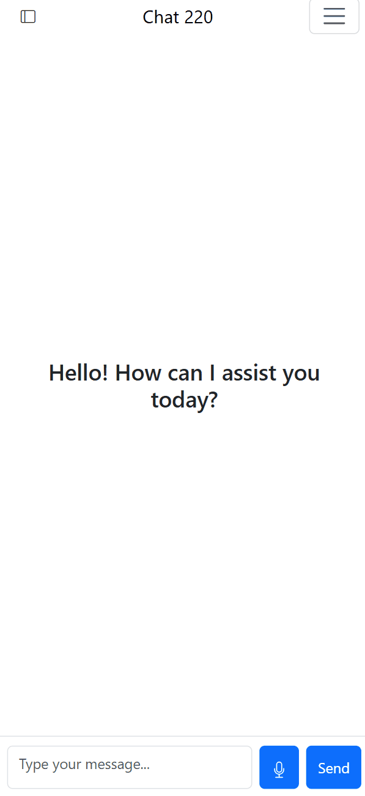

# Link to Youtube Project Presentation

https://youtu.be/5kuKlZ_bMj4

# Link to live site (pages)

https://joseph-ampfer.github.io/AI_Chat_220/

# To try out our site, download our repo and:
1. Get free api key from groq  https://console.groq.com/keys
2. Make `config/` folder in root
3. In `config/`, make `keys.js` file and write `const GROQ_API_KEY = "your-key"`
4. Done!

# Team and Contributions

***Joey Ampfer***
- chat page
- working with groq and other ai api's

***Xander Murphy***
- sign up/sign in pages
- storage of users

***Landen Tomlin***
- Index page formatting and style
- Pagination and dynamically displaying posts
- Search bar animation and functionality

# Mobile demo

  
  

